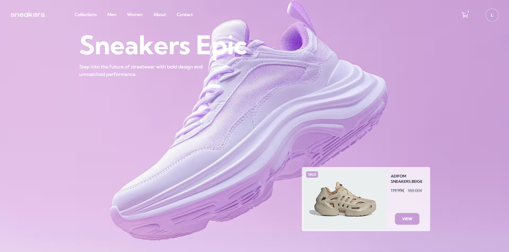
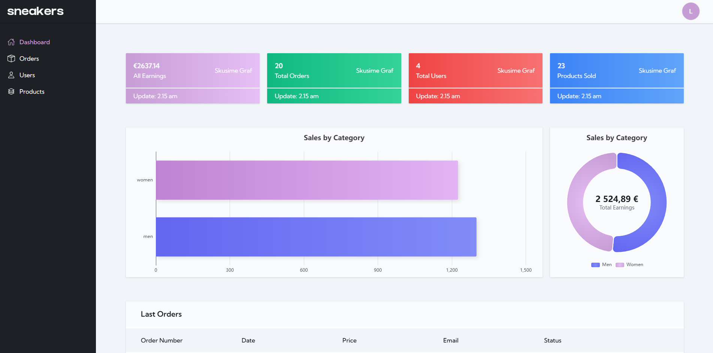
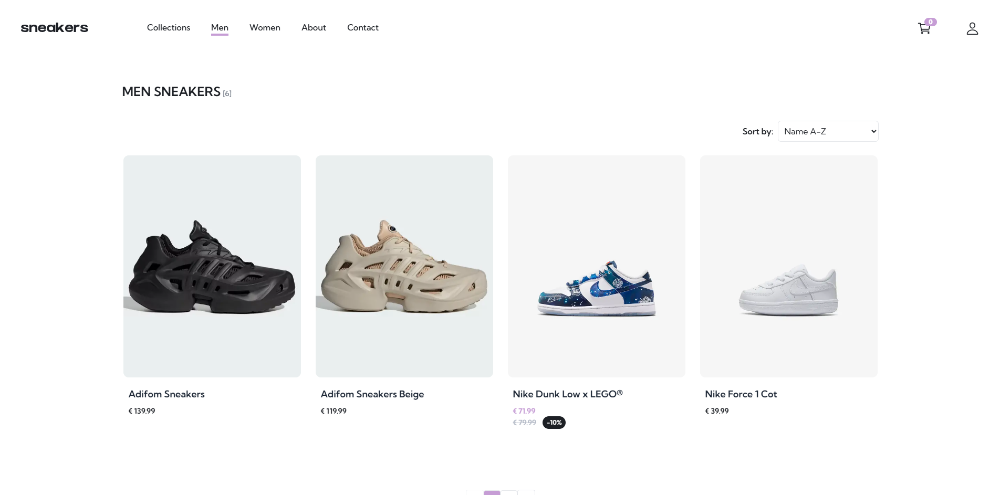
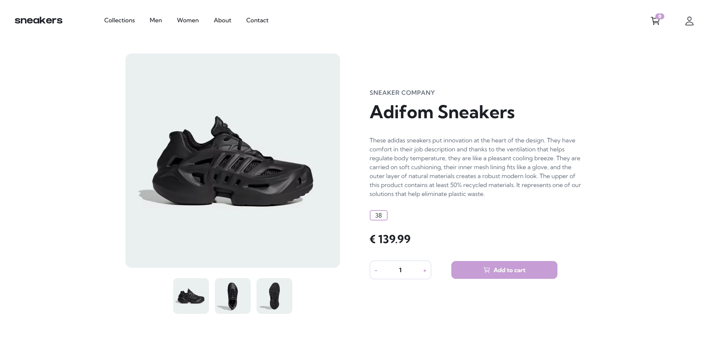

# 👟 SneakPeak – E-commerce Web Application

A modern e-commerce web application focused on sneakers, built with the Next.js ecosystem.  
The project started as a Frontend Mentor challenge and gradually evolved into a more complete application with authentication, checkout flow, and an admin dashboard.

🌐 Live Demo: https://sneakers-nextjs-2-0.vercel.app  
📁 Repository: https://github.com/MistaKupa/sneakers-nextjs-2.0

## 📸 Preview

| Home Page                  | Admin Dashboard                      |
| -------------------------- | ------------------------------------ |
|  |  |

| Products                           | Product Details                          |
| ---------------------------------- | ---------------------------------------- |
|  |  |

## 🎯 Project Background

The project was originally based on a **Frontend Mentor "Product Page" challenge**.  
Instead of stopping at the original task, I expanded the project into a more complete e-commerce style application.

The goal was to practice:

- modern React architecture
- Next.js App Router
- authentication
- payment flow
- working with a database
- building a small admin interface

## 🛠 Tech Stack

**Framework**

- Next.js (App Router)

**Frontend**

- React
- TypeScript
- Tailwind CSS
- Framer Motion
- GSAP

**State & Data**

- TanStack Query
- React Context

**Backend / Database**

- Supabase (PostgreSQL + Auth)

**Payments**

- Stripe

**Data Visualization**

- ECharts

## ✨ Features

- Product catalog
- Dynamic product pages
- Shopping cart
- User authentication (login / signup)
- Stripe checkout flow
- Admin dashboard
- Sales analytics dashboard
- Responsive design
- UI animations

## 🔐 Admin Access

This project includes a simple admin dashboard.

To access it use the following credentials:

Email: admin@sneakers.com  
Password: admin123

Admin routes:

/admin/dashboard  
/admin/products

⚠️ Note:  
Please avoid deleting core products because it may affect order records in the database.  
For testing you can create or delete test products.

## 💡 Key Implementations

### Admin Dashboard

The admin dashboard visualizes sales data using **ECharts** and displays product analytics.

### Authentication

Authentication is handled by **Supabase**, providing persistent sessions and protected routes.

### Checkout

Payments are implemented using **Stripe Elements** and connected to the database to store orders after successful payment.

## 📚 What I Learned

Through this project I improved my skills in:

- structuring larger React / Next.js projects
- working with server-side features
- integrating third-party services (Stripe, Supabase)
- building responsive UI with Tailwind
- managing application state

## 🚀 Future Improvements

Planned improvements:

- implement collections page and in navigation (removed for now)
- error & loading states
- Stripe webhook integration
- unit testing
- performance optimization
- improved product management

This project is actively maintained and will continue to evolve as I deepen my knowledge of modern web development.

Currently transitioning parts of the project to TypeScript
as part of my learning process.

## 👨‍💻 About Me

Self-taught frontend developer focused on building modern web applications with **React and Next.js**.

Currently looking for **junior frontend opportunities** in:

- Slovakia (- on-site hybrid / remote)
- Austria (Linz / Vienna – on-site or hybrid / remote)
